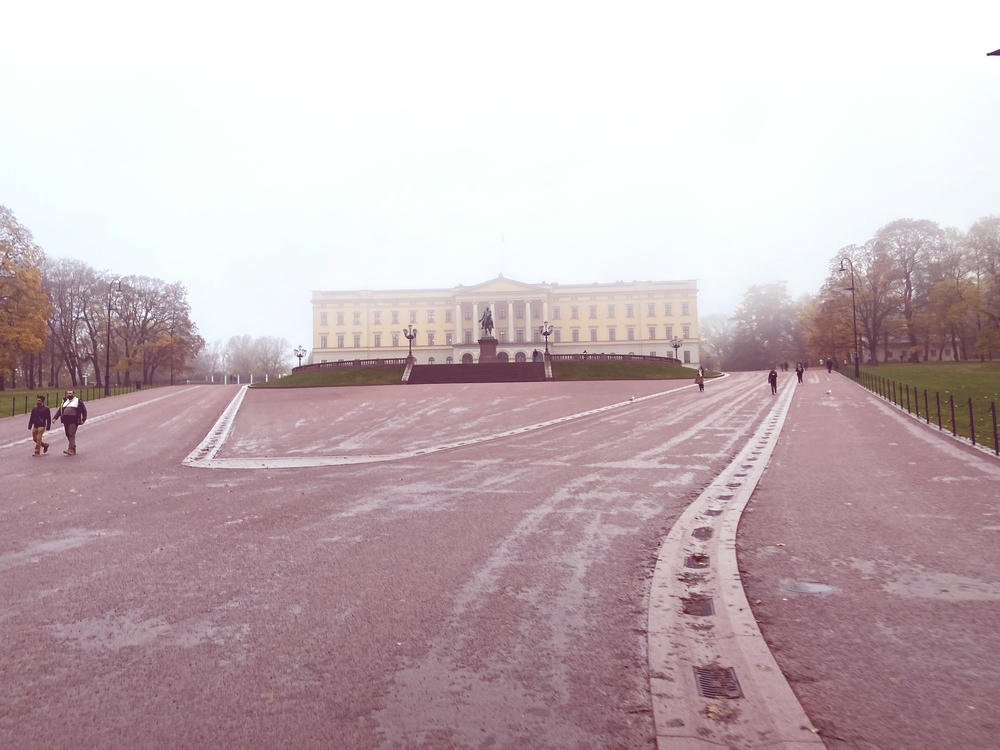

# Idea

We now want to build a slightly more complex application.

The idea is to use an existing image manipulation library
to apply filters to a given image[^1].
This example will show us how to use an existing Rust crate,
how to handle input and output and how to interact with the different environments.

We start off with building a command-line tool run using `wasmtime`,
then build a web application running completely client-side,
and last as an edge computing API that processes images posted to it.

We will work with the following example image (but really any image will work).
Right-click it and save it to disk for later use.

When applying the filter named "1977", this is the result:

Several more filters are available in the library.

[^1]: The image filters are inspired by Instagram. The implementation is based on [CSSgram](https://github.com/una/CSSgram), which was ported to Rust by [@ha-shine](https://github.com/ha-shine). The example image was taken on 2022-10-28 by Jan-Erik Rediger.

[alexjodin]: https://unsplash.com/@ajshotz
[unsplash]: https://web.archive.org/web/20170624073726/https://unsplash.com/photos/F0bx43QKhRA

