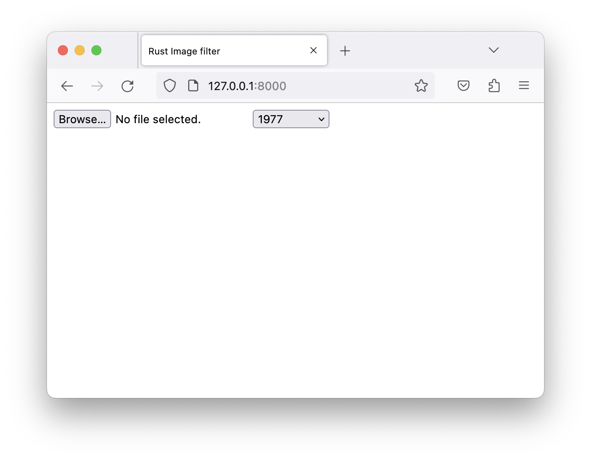

# HTML Frontend

Your image filter application needs some basic UI to allow a user to specify an image on disk
and select the image filter to be applied.

✅ Start with a new file `app/index.html` with a basic HTML structure.

```html
{{#include ../../../../crates/web/app/index.html:1:7}}
{{#include ../../../../crates/web/app/index.html:39:}}
```

✅ To upload a picture the frontend needs a file selector, so add the following in between the `<body>` tags.

```html
{{#include ../../../../crates/web/app/index.html:8}}
```

The `accept` attribute limits what files a user can select.
As this application is for images it's enough to limit it to PNG and JPEG files for now.

✅ Additionally the user should be able to select a filter. List out all available ones manually.

```html
{{#include ../../../../crates/web/app/index.html:9:34}}
```

In case of `None` no filter should be applied and the user should see the image they selected unchanged.

✅ To show that an upload is in progress add a `<span>` where you can show a message.

```html
{{#include ../../../../crates/web/app/index.html:35}}
```

✅ You also need a place to display the resulting image.

```html
{{#include ../../../../crates/web/app/index.html:37}}
```

✅ And last but not least include the JavaScript frontend code.

```html
{{#include ../../../../crates/web/app/index.html:38}}
```

The JavaScript file does not exist yet.
You will create that in the next chapter.

✅ To ensure everything is working as expected for now serve the files over HTTP using `http`

```
cd app
http
```

Your application should be reachable at <http://127.0.0.1:8000/>.
It should look something like this:



---

In the [next chapter](javascript.md) you will finally write the JavaScript code to load and run the WebAssembly module.
